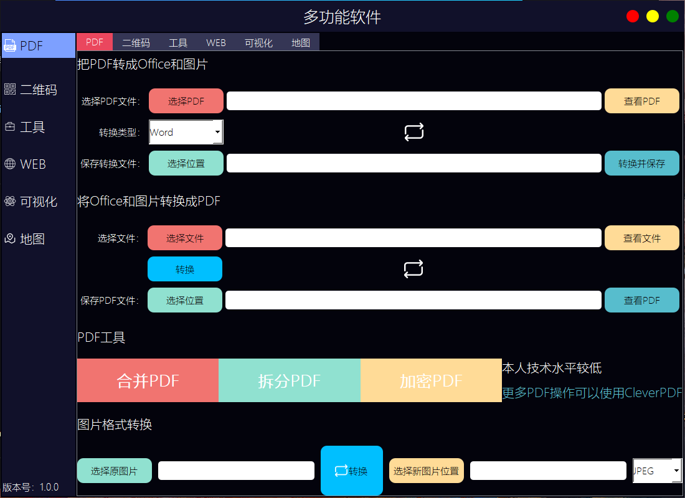
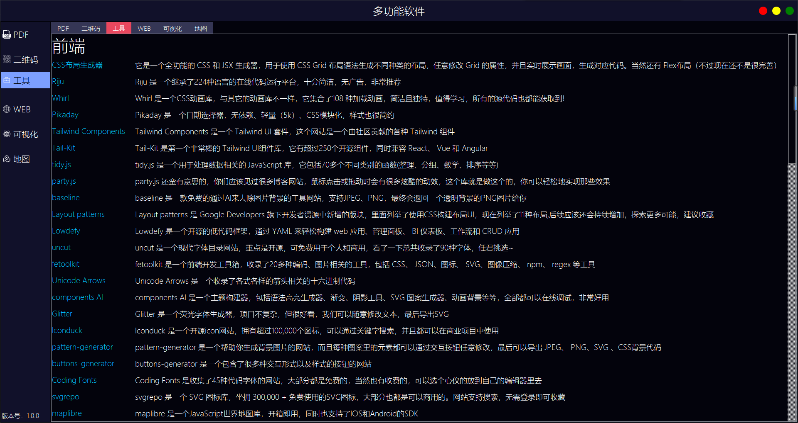
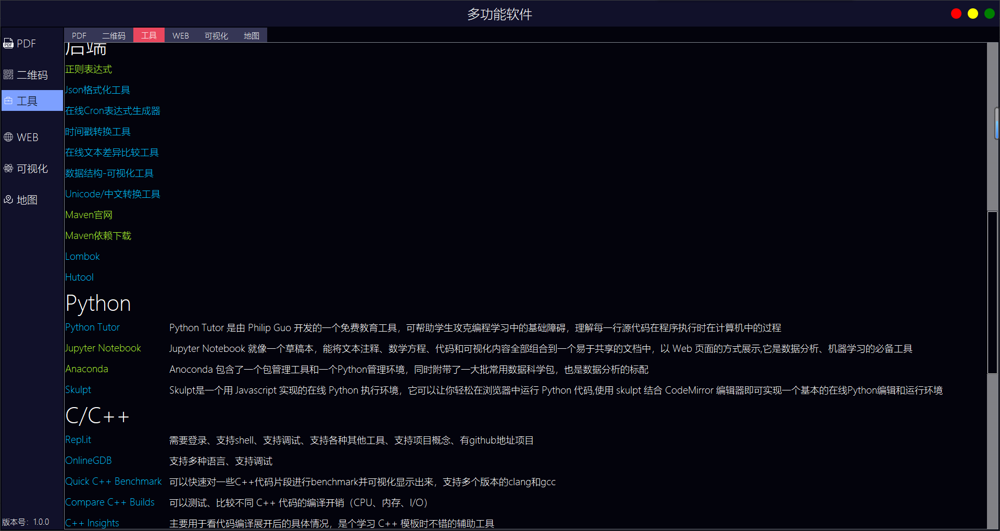
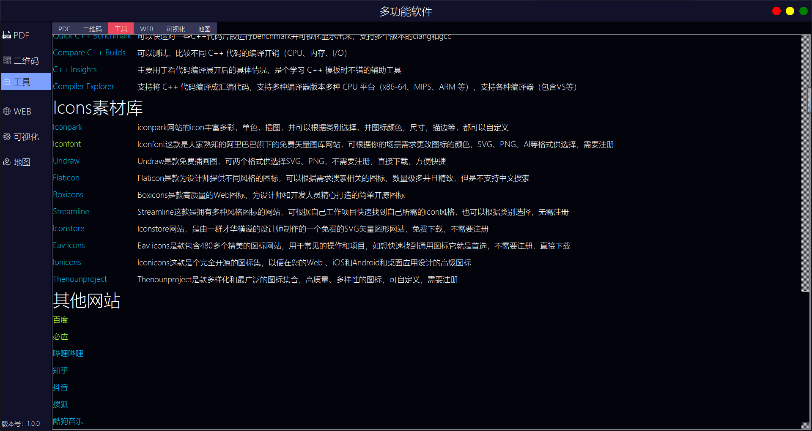
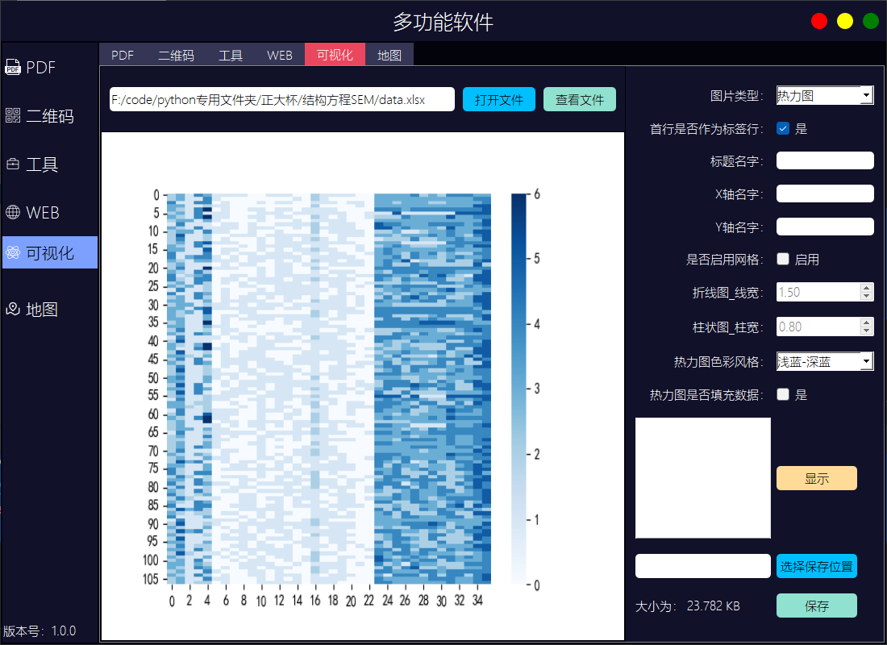
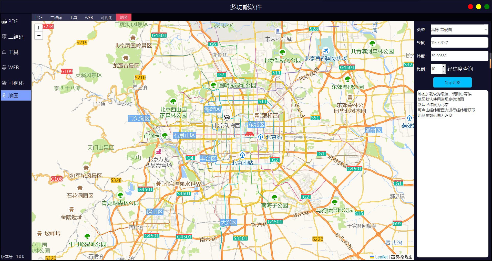

## Multifunctional-software
尝试开发的第一个功能集成型软件

软件具有PDf、二维码、编程在线工具链接表、小型浏览器、数据可视化绘图、地图查询的功能

关键字:`Python` `Pyqt5` `PDF` `Qrcode` `Web` `Data Visual` `Map`

## 系统配置
* 系统：Windows 11

* Python代码编辑器：PyCharm Community Edition 2022.3.3

* Python解释器：Python3.10

* Pyqt5版本：5.15.10

##  效果展示
* ### PDF

* ### Qrcode

* ### 在线编程工具链接表

  

  

* ### Web

* ### Data Visual

* ### Map

